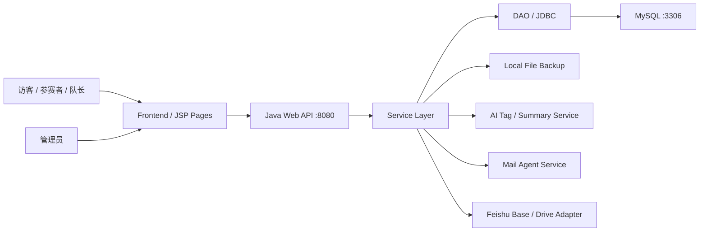

# 概要设计

## 1. 系统架构



## 2. 端口规划

| 服务 | 端口 | 说明 |
| --- | --- | --- |
| 静态前端预览 | `5173` | 当前 `frontend/` 可用 `python3 -m http.server 5173` 预览 |
| Java Web 后端 | `8080` | Tomcat / Servlet 容器端口 |
| MySQL | `3306` | 业务主库 |
| API 前缀 | `/api` | 所有后端接口统一前缀 |
| 文件访问 | `/uploads/*` | MVP 可临时放 Web 目录，正式部署建议放 Web 根目录外并通过受控接口下载 |

## 3. 模块拆分

| 模块 | 责任 | 包 / 目录 |
| --- | --- | --- |
| 活动配置 | 活动基础信息、赛道、奖项、开关、截止时间 | `control/EventServlet`, `service/EventService` |
| 表单配置 | 报名字段、提交字段、字段排序、必填校验 | `FormFieldService` |
| 报名组队 | 个人报名、团队报名、队员信息、重复校验 | `RegistrationService`, `TeamService` |
| AI 整理 | 标签、摘要、组队建议、邮件辅助文本 | `integration/ai` |
| 审核通知 | 审核状态流转、邮件草稿、发送记录 | `ReviewService`, `integration/mail` |
| 项目提交 | 项目信息、附件、本地备份、提交截止校验 | `ProjectService`, `FileService` |
| 开放评分 | 评分规则、重复评分限制、均分统计 | `RatingService` |
| 投票互动 | 投票开关、票数统计、重复投票限制 | `VoteService` |
| 飞书同步 | 报名、作品、附件 metadata 同步状态和重试 | `integration/feishu` |
| 管理后台 | 后台登录、权限、仪表盘、操作日志 | `AdminService`, `OperationLogService` |

## 4. 数据流

### 4.1 报名数据流

```text
前台报名表 -> RegistrationServlet -> RegistrationService
-> 保存 registrations / registration_members
-> 创建 ai_tasks
-> 管理员审核
-> 生成邮件草稿
-> 人工确认发送
-> 写 mail_logs
-> 飞书同步或导出
```

### 4.2 作品数据流

```text
队长提交作品 -> ProjectServlet -> ProjectService
-> 校验队伍和截止时间
-> 保存 projects
-> 附件写入本地 uploads
-> 保存 project_files
-> 展示页读取 public projects
-> 开放评分 / 投票
-> 飞书备份
```

## 5. 存储策略

MVP 建议采用“本地留底 + 飞书备份”的策略：

- 数据库保存结构化数据：报名、队伍、项目、评分、邮件、同步状态。
- 本地保存文件原件：PPT、PDF、HTML、ZIP、MP3、图片。
- 数据库保存附件 metadata：文件名、MIME、大小、路径、哈希、所属项目。
- 飞书备份结构化数据到 Base，附件可同步到 Drive 或仅同步本地路径和 metadata。
- 同步失败不影响主流程，写入 `feishu_sync_logs` 并允许管理员重试。

## 6. Java 可行性判断

Java Web 能完成本项目 MVP。原因：

- CRUD、表单、审核、文件上传、邮件发送、MySQL 持久化都是典型 Java Web 实训能力。
- AI、飞书、邮件都可以封装成 service，不影响 MVC 主体。
- 前期不做视频上传和转码，显著降低文件处理复杂度。
- 开放评分替代评委角色后，权限模型更简单。

建议先做 Servlet / JSP / JDBC 版本，后续如果需要再迁移 Spring Boot 或前后端分离。
