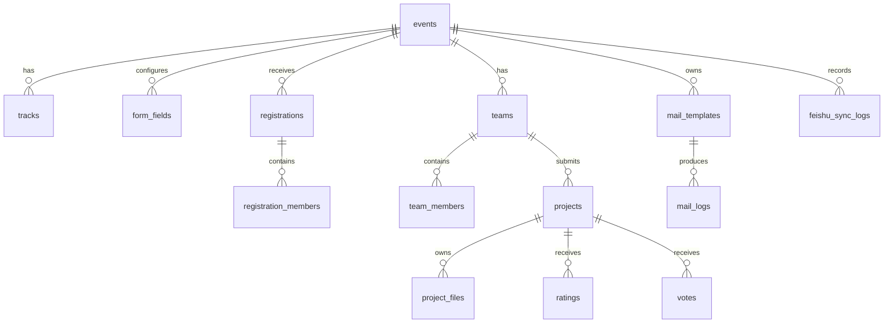

# 详细设计：数据库设计

数据库：MySQL 8。建表脚本见 `database/schema.sql`。

## 1. 核心实体关系

## 2. 主要表

| 表 | 说明 | 关键字段 |
| --- | --- | --- |
| `users` | 用户和管理员账号 | `role`, `email`, `phone`, `password_hash` |
| `events` | 单场活动配置 | `title`, `status`, `registration_deadline`, `submission_deadline`, `rating_enabled` |
| `tracks` | 赛道 | `event_id`, `name`, `sort_order` |
| `form_fields` | 动态表单字段 | `target_type`, `field_key`, `field_type`, `required`, `sort_order` |
| `registrations` | 报名主表 | `registration_type`, `contact_phone`, `status`, `payload_json`, `ai_tags_json` |
| `registration_members` | 报名成员明细 | `registration_id`, `name`, `role`, `phone`, `email` |
| `teams` | 队伍 | `event_id`, `team_name`, `leader_user_id`, `status` |
| `team_members` | 队伍成员 | `team_id`, `name`, `role`, `phone`, `join_status` |
| `projects` | 作品 | `team_id`, `track_id`, `title`, `demo_url`, `code_url`, `status` |
| `project_files` | 附件 | `project_id`, `file_type`, `file_path`, `mime_type`, `size_bytes`, `sha256` |
| `rating_rules` | 开放评分规则 | `event_id`, `scope`, `max_score`, `duplicate_strategy` |
| `ratings` | 评分记录 | `project_id`, `score`, `rater_key`, `source_type` |
| `votes` | 投票记录 | `project_id`, `voter_key`, `source_type` |
| `mail_templates` | 邮件模板 | `scene`, `subject_template`, `body_template` |
| `mail_logs` | 邮件记录 | `recipient_email`, `subject`, `status`, `error_message` |
| `ai_tasks` | AI 任务 | `target_type`, `target_id`, `task_type`, `status`, `result_json` |
| `feishu_sync_logs` | 飞书同步记录 | `target_type`, `target_id`, `sync_type`, `status`, `remote_url` |
| `operation_logs` | 管理员操作日志 | `actor_user_id`, `action`, `target_type`, `target_id` |

## 3. 状态枚举

### events.status

| 状态 | 含义 |
| --- | --- |
| `draft` | 草稿 |
| `published` | 已发布 |
| `running` | 比赛中 |
| `archived` | 已归档 |

### registrations.status

| 状态 | 含义 |
| --- | --- |
| `pending` | 待审核 |
| `approved` | 已通过 |
| `rejected` | 已拒绝 |
| `waitlist` | 候补 |
| `cancelled` | 已取消 |

### projects.status

| 状态 | 含义 |
| --- | --- |
| `draft` | 草稿 |
| `submitted` | 已提交 |
| `locked` | 截止后锁定 |
| `published` | 已展示 |
| `archived` | 已归档 |

## 4. 关键约束

- 同一活动下，`registrations.contact_phone` 不允许重复。
- 同一活动下，团队名建议唯一。
- 同一成员手机号不能同时加入多个已通过队伍。
- 同一 `project_id + rater_key` 只能评分一次。
- 同一 `project_id + voter_key` 只能投票一次。
- 附件不保存视频类型；MVP 不允许 `video/mp4`、`video/mov`、`video/webm`。
- AI 输出只作为辅助字段保存，不直接覆盖管理员审核结果。

## 5. 附件类型

MVP 允许：

- 文档：`ppt`, `pptx`, `pdf`, `doc`, `docx`
- 原型：`html`, `zip`
- 音频：`mp3`, `wav`
- 图片：`png`, `jpg`, `jpeg`, `webp`
- 代码包：`zip`

MVP 不允许：

- `mp4`, `mov`, `webm`, `avi`
- 超大压缩包
- 可执行文件
