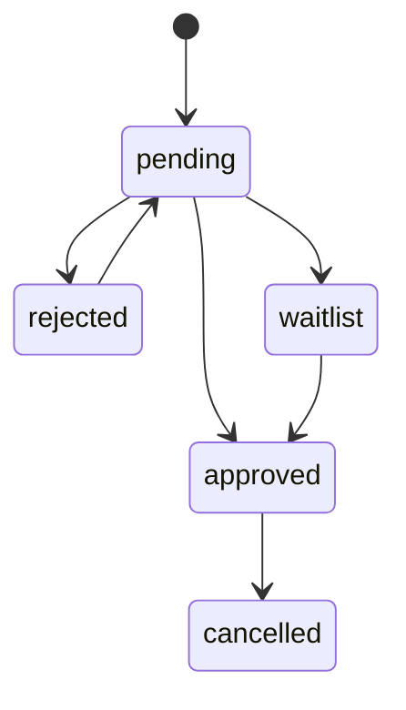

# 业务逻辑判断

## 1. 报名开放判断

允许提交报名需要同时满足：

- 活动状态为 `published` 或 `running`。
- 当前时间早于 `registration_deadline`。
- 活动开启报名开关。
- 同一活动下联系人手机号或邮箱未重复报名。

拒绝提交的场景：

- 活动为 `draft` 或 `archived`。
- 已过报名截止时间。
- 必填字段缺失。
- 团队报名缺少队长信息。
- 成员手机号重复出现在同一团队。

## 2. 个人 / 团队报名判断

个人报名：

- 保存 `registrations.registration_type = individual`。
- 可填写技能、赛道意向、组队需求。
- 审核通过后可在后台或现场组队。

团队报名：

- 保存 `registrations.registration_type = team`。
- 队长必须填写队伍名和队员列表。
- 同一成员不能加入多个已通过队伍。
- 审核通过后生成或绑定 `teams` 和 `team_members`。

## 3. AI 标签判断

AI 可以做：

- 从报名信息提取技能标签。
- 生成赛道匹配建议。
- 生成组队建议。
- 生成管理员可读摘要。
- 生成邮件草稿。

AI 不可以做：

- 自动通过或拒绝报名。
- 自动替管理员发送邮件。
- 自动修改用户原始报名字段。
- 自动评分或投票。

AI 输出保存到 `ai_tasks.result_json` 和业务表冗余字段，管理员可手动编辑。

## 4. 审核状态流转



判断规则：

- 只有管理员可以改变审核状态。
- 每次审核写入 `operation_logs`。
- 审核通过后可以触发邮件草稿。
- 邮件草稿生成后仍需管理员确认发送。
- 状态变更不要求飞书同步成功，失败进入重试队列。

## 5. 邮件发送判断

邮件发送前必须满足：

- 目标报名记录存在。
- 收件邮箱存在且格式有效。
- 模板或 AI 草稿已生成。
- 管理员完成预览和确认。

发送后：

- 成功写入 `mail_logs.status = sent`。
- 失败写入 `mail_logs.status = failed` 和 `error_message`。
- 不因邮件失败回滚审核状态。

## 6. 项目提交判断

允许保存草稿：

- 用户属于已通过报名或管理员代录。
- 所属活动尚未归档。

允许正式提交：

- 当前时间早于 `submission_deadline`，或管理员重新开放提交。
- 队伍存在且队长或管理员操作。
- 项目标题、简介、赛道、团队成员信息完整。
- 附件类型在白名单内。
- 不包含视频文件或视频字段。

提交后：

- `projects.status = submitted`。
- 附件写入本地备份目录。
- `project_files` 保存 metadata。
- 可创建飞书同步任务。

## 7. 附件判断

允许：

- `ppt`, `pptx`, `pdf`, `html`, `zip`, `mp3`, `wav`, `png`, `jpg`, `jpeg`, `webp`

不允许：

- `mp4`, `mov`, `webm`, `avi`
- `exe`, `dmg`, `pkg`, `sh`, `bat`
- 超过管理员配置大小的文件。

文件命名建议：

```text
uploads/{eventId}/{projectId}/{yyyyMMddHHmmss}-{sha8}-{originalName}
```

## 8. 开放评分判断

允许评分需要同时满足：

- 活动开启 `rating_enabled`。
- 项目状态为 `submitted` 或 `published`。
- 活动未归档。
- 当前时间在评分开放时间内。
- 评分来源符合规则：访客、报名选手、现场口令用户等。
- 同一 `project_id + rater_key` 未评分。

评分规则：

- MVP 使用 1-5 分。
- 不区分评委和普通用户。
- 管理员可以关闭评分或切换为归档展示。
- AI 不参与评分。

## 9. 投票判断

投票可与评分并行，也可单独开启：

- 同一 `project_id + voter_key` 只能投一次。
- 活动归档后关闭投票按钮。
- 作品展示页可按票数、均分、提交时间排序。

## 10. 飞书同步判断

同步对象：

- 报名记录。
- 队伍记录。
- 作品记录。
- 附件 metadata。
- 邮件发送状态。

同步策略：

- 本地数据库是主数据源。
- 飞书是备份和协作视图。
- 同步失败不阻断报名、审核、提交、评分主流程。
- 失败写入 `feishu_sync_logs`，管理员可重试。
- MVP 可先导出 CSV / JSON；V1 再自动接入飞书 Base / Drive。
